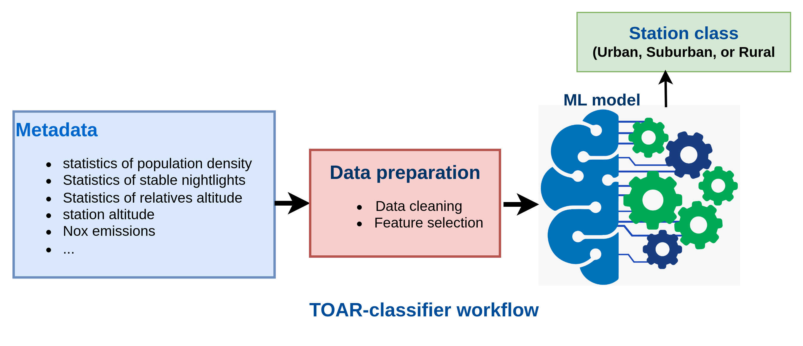

# TOAR-classifier v2: A data-driven classification tool for global air quality stations

This project implements end-to-end machine learning for an objective station classification for global air quality monitoring stations as described in [1]. It has been developed in support of the international Tropospheric Ozone Assessment Report initiative, phase 2 (TOAR-II) [2]. 

TOAR has implemented a terabyte-scale database for global air quality data [3] with multiannual time series from over 23,000 stations. The objective of the station classification performed in this project is to create objective labels for the measurement sites as **"urban"**, **"suburban"**, or **"rural"** based on various features that provide hints of the characteristics of a station location. To this end, the machine learning models implemented here make use of the extensive metadata in the TOAR database, in particular the "global metadata" that is derived from various Earth Observation satellite data products (for details, see [1])

This second version (v2) features a modular architecture designed for both research (via notebooks) and production-ready inference (via the `src/` library).



## 📁 Project Structure

The project has been refactored into a modular library to improve maintainability and ease of use:

- **`configs/`**: Configuration files and experiment parameters (e.g., `model_params.yaml`).
- **`data/`**: Datasets used for training and testing, including machine learning model predictions.
- **`figures/`**: Visualizations and figures.
- **`models/`**: Storage for trained model artifacts and processors (`.pkl` files).
- **`notebooks/`**:
  - `01_eda_traning.ipynb`: Main Jupyter notebook for exploratory data analysis and model training.
  - `02_run_inference.ipynb`: Example notebook demonstrating end-to-end inference using the `src` library.
- **`script/`**: 
  - `dataloader.py`: Utilities to fetch station metadata from the TOAR-II API.
- **`src/`**: Core modular codebase:
  - `processing.py`: Stateful data cleaning and preprocessing (imputation, encoding).
  - `feature.py`: Feature engineering and extraction from raw metadata.
  - `modeling.py`: Implementations of unsupervised (KMeans, GMM) and supervised (Ensembles) models.
  - `inference.py`: End-to-end prediction pipeline for new station codes or datasets.
  - `evaluator.py`: Performance metrics and validation tools.
  - `plotting.py`: Visualization utilities for station maps and model results.
- **`requirements.txt`**: List of required Python packages.

### 🚀 Running the Code

**Tested on:** Ubuntu 24.04 with Python 3.12

### 🛠 Prerequisites
Ensure you have Python 3.12 installed along with either Jupyter Notebook, JupyterLab, or VS Code.

1. **Clone the repository:**
   ```bash
   git clone https://gitlab.jsc.fz-juelich.de/esde/toar-public/ml_toar_station_classification.git
   cd TOAR-Classifer-V2
   ```

2. **Create and activate a virtual environment:**
   ```bash
   python -m venv venv
   source venv/bin/activate
   ```

3. **Install required packages:**
   ```bash
   pip install -r requirements.txt
   ```

4. **Register the kernel with Jupyter (Optional):**
   ```bash
   python -m ipykernel install --user --name=toar-v2 --display-name "Python (TOAR-V2)"
   ```

5. **Run the analysis:**
   Open `notebooks/01_eda_traning.ipynb` and select the `toar-v2` kernel.
   Run all cells in `notebooks/01_eda_traning.ipynb`.

## 🛠 Usage (Inference)

You can use the modular `src` library to run predictions for specific stations:

```python
from src.inference import TOARInference

# Initialize inference pipeline
infer = TOARInference(models_dir="models", best_model="voting", verbose=False)

# Predict using a list of TOAR station codes
results = infer.predict(["DE0001A", "FR0123X"])
print(results[["area_code", "pred_voting"]])
```

See examples in `notebooks/02_run_inference.ipynb`


[1] Mache, R. K., Schröder, S., Langguth, M., Patnala, A., & Schultz, M. G. (2025). *TOAR-classifier v2: A data-driven classification tool for global air quality stations*. EGUsphere preprint. https://egusphere.copernicus.org/preprints/2025/egusphere-2025-1399/

[2] TOAR-II: Tropospheric Ozone Assessment Report, Phase 2. IGAC Project. https://igacproject.org/activities/TOAR/TOAR-II

[3] TOAR Data Infrastructure. Forschungszentrum Jülich. https://toar-data.fz-juelich.de


### Citation

If you use this please cite

```bibtex
@article{Mache2025TOARClassifier,
  author = {Ramiyou Karim Mache and Sabine Schröder and Michael Langguth and Ankit Patnala and Martin G. Schultz},
  title = {TOAR-classifier v2: A data-driven classification tool for global air quality stations},
  year = {2025},
  note = {Correspondence: Ramiyou Karim Mache (k.mache@fz-juelich.de)},
  url = {https://egusphere.copernicus.org/preprints/2025/egusphere-2025-1399/}
}
```

